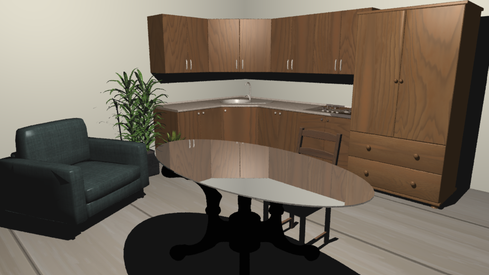

# 3D Raytracing Engine (SDL2)
> A C++ Raytracer implementation featuring Mesh loading and Texture mapping.  
> Developed for the **Computer Graphics Fundamentals** university course.

* **Ray-Object Intersection:** Support for geometric primitives and complex 3D models.
* **Mesh Loading (.obj):** Capability to parse and render external 3D models using the `.obj` format.
* **Texture Mapping:** Implementation of UV mapping to apply textures to 3D surfaces.
* **Phong Shading Model:** Advanced lighting including:
    * **Ambient** reflection for base scene illumination.
    * **Diffuse** (Lambertian) reflection for surface color.
    * **Specular** highlights for shiny surfaces.
* **Raytracing Core:** Recursive ray casting for handling shadows and reflections.
* **SDL2 Integration:** Direct pixel manipulation and real-time window rendering.

# Final Result

